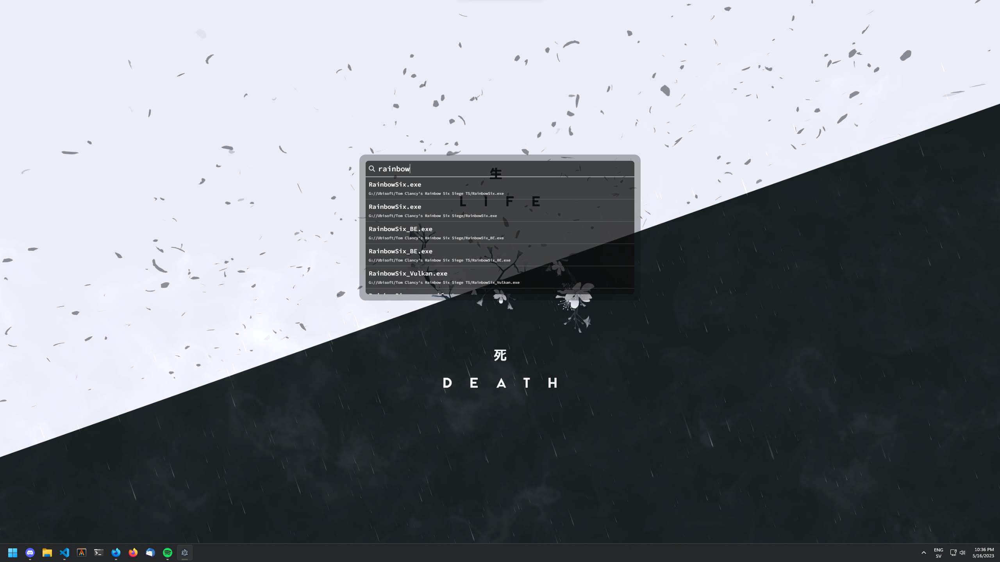

# Indexing

Indexing is a simple search tool that allows users to search for specific content within a given drive or collection of file. It provides a straightforward interface and efficient search algorithms to deliver accurate results quickly.

## Preview

## Features

- **Fast and Efficient Search:** Utilize advanced search algorithms to ensure quick and accurate results.
- **Flexible Search Queries:** Will support various search query types, such as exact matches, partial matches, and fuzzy searches.
- **Customizable Search Parameters:** Will Allow users to specify search parameters and filters to narrow down their results.
- **Scalable and Lightweight:** Designed to handle large datasets while remaining lightweight and resource-friendly.

## Current way of usage

#### Solution 1 (graphical)

**IMPORTANT when using this you will need a c++ compiler for the keybinds
note this subject to change**

1. Clone the repository: `git clone https://github.com/TechMDW/indexing.git`
2. Navigate to the project directory: `cd indexing`
3. Run the program: `go run ./cmd/indexing`
4. use the `ctrl + space` to toggle the search bar if its visible

#### Solution 2 (development, no c++ compiler)

1. Clone the repository: `git clone https://github.com/TechMDW/indexing.git`
2. Navigate to the project directory: `cd indexing`
3. Run the program: `go run ./cmd/indexing_dev`

## Contributing

Contributions are welcome! If you'd like to contribute to Indexing, please follow these steps:

1. Fork the repository.
2. Create a new branch: git checkout -b my-feature-branch.
3. Make your changes and commit them: git commit -m 'Add some feature'.
4. Push the changes to your fork: git push origin my-feature-branch.
5. Submit a pull request detailing your changes.

Please ensure that your code adheres to the project's coding conventions and that you update relevant documentation as needed.

## License

This project is licensed under the [MIT License](LICENSE).

## Contact

If you have any questions, suggestions, or feedback, please feel free to reach out to us at [contact@techmdw.com].

## Authors

- [JocularMarrow](https://github.com/JocularMarrow)
- [Simple-MAX](https://github.com/Simple-MAX)
